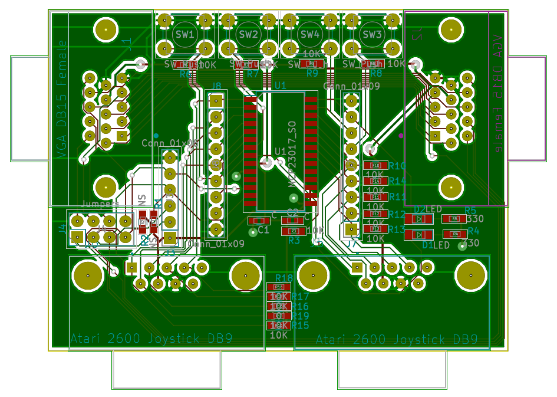

# VGA I2C GPIO + Atari 2600 Joystick Extender

** A detailed write-up about this project can be found [here](https://tomverbeure.github.io/2019/02/05/VGA-I2C-My-First-PCB.html). **

The [Pano Logic G1](https://github.com/tomverbeure/panologic) doesn't have an easy
way to add GPIOs or non-USB input devices.

If you want to control a game like PacMan with a joystick, you need to be creative.
One way to do that is by soldering some wires to connect unused VGA pins to the
FPGA as demonstrated by the [Pano Man](https://github.com/skiphansen/pano_man) project.

But only allow for a lot of buttons. The Pano Man README suggested connecting a
GPIO I2C expander to the I2C wires of the VGA cable.

This project does exactly that!

It's a VGA to VGA feedthru board that taps the I2C wires, adds an I2C GPIO expander, connects it
to 2 Atari 2600 joystick ports, 4 additional switches and 2 LEDs.

I shared the schematics of this board with Skip, the author of Pano Man, and he made a
version that supports this board!

The design is very simple and it was the perfect project to learn KiCAD and design and 
send out for production my first PCB.

The schematic:

The PCB layout:

The result:

[Video](https://player.vimeo.com/video/315809161)
